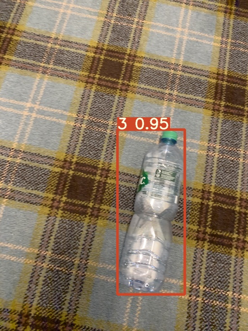
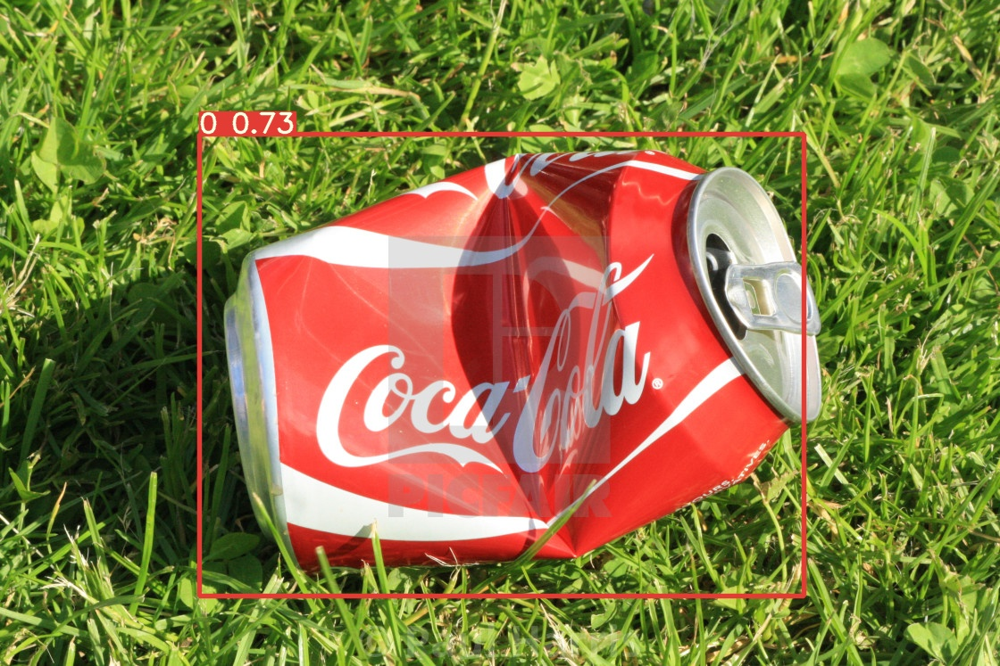
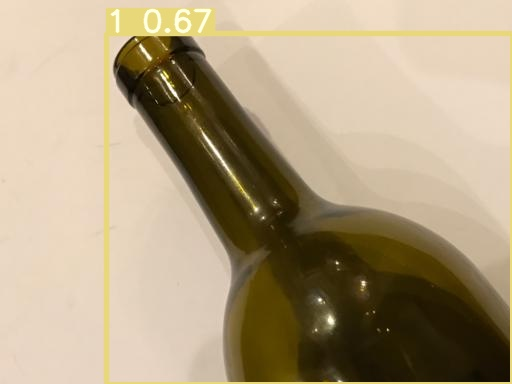

# RecycleNet 
## Inspiration
RecycleNet is a project inspired by the growing magnitude of the global waste problem. 
Though reducing our overall footprint should be our final goal, increasing efficiency of recycling will help curb the problem.
Though most countries have begun recycling programs, it is limited to splitting waste in two groups : recyclable and non-recyclable. 
Splitting the recyclable waste into the different groups that require seperate processes is a time a labour intensive process. 
Another issue is the lack of awareness among people on the correct way to split and prepare waste.

By using Computer vision, both these problems can be solved. 

## Performance
Overall acheived accuracy of over 95%. Results shown below.





## Dataset
Custom built DIRT dataset.

All images are annotated in yolo format. 
|No.| Class | Number of images |
|--- | --- | --- |
|1| liquid/water drop| 120 |
|3|coffee stain|56|
|1|Dust|69|
|2| Paper | 554 |
|3| shredded Paper |130 |
|4| Bottles/cup | 1629 |
|5| Metal |1207|
|7| food pouches|34|
|1|  Glass | 1223 |
|2| HDPME | 1049 |

## Training Instructions
Clone darknet directory and navigate to darknet/build/darknet/x64
```
git clone https://github.com/AlexeyAB/darknet.git
$ cd darknet/build/darknet/x64
```
Download docker container from https://hub.docker.com/r/daisukekobayashi/darknet and then run container in detache mode to enable training in backgrounnd. Exec into the container.
```
docker pull daisukekobayashi/darknet:gpu
docker run -d --runtime=nvidia -it -v $PWD:/workspace -w /workspace daisukekobayashi/darknet:gpu bash
docker exec -it {name of container} bash
```
Currently, the compiled darknet file is in the wrong directory (usr/loca/bin) . Move it to workspace directory or /usr/local/bin/
```
mv /usr/loca/bin /workspace
```
Clone this repo. All data is in the DIRT folder. Add all jpg file paths to train.txt, relative to the darknet executable using something like this in the DIRT directory.
```
ls -R | grep jpg > train.txt
```
prepare files as listen in https://github.com/AlexeyAB/darknet#how-to-train-with-multi-gpu. Config and base model used for training are available in the train folder. other files are in the data folder.

To train, enter following command in docker container 
```
./darknet detector train data/obj.data yolov3-tiny.cfg.txt yolov3-tiny.conv.11
```

## Results 
Trained model is available in the models folder (models/yolov3-tiny_final.weights)
